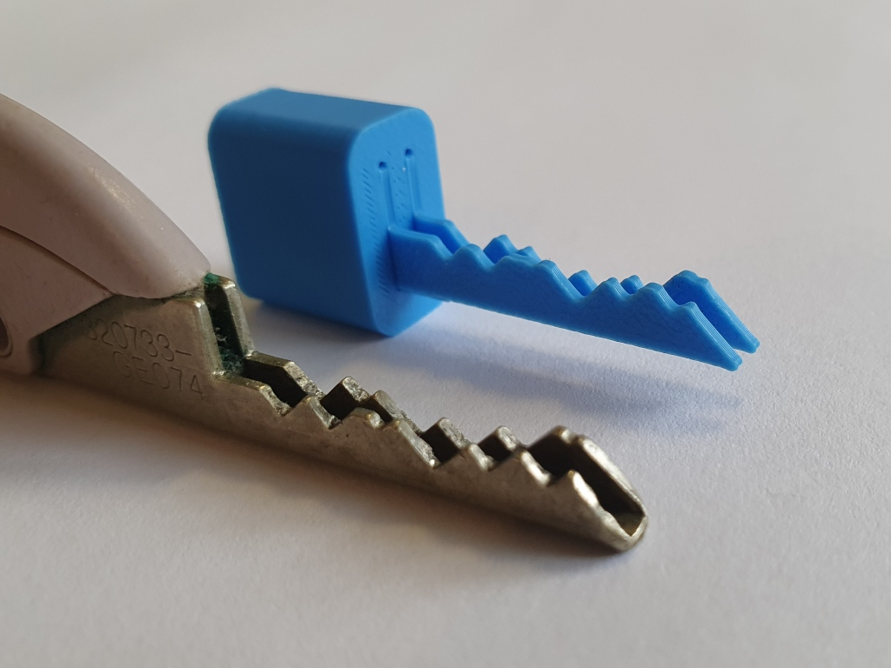

# BiLock FG key profile generator



## Dependencies

Python 3.14+

You need to install: `uv`

## Generate profiles

```bash
uv run py generate.py [code]
```

This creates a new STL in the current directory.

There's a lot of optional configuration, use `-h` to see it:

```bash
usage: generate.py [-h] [--blade_height BLADE_HEIGHT] [--tip_angle TIP_ANGLE] [--blade_thickness BLADE_THICKNESS]
                   [--blade_length BLADE_LENGTH] [--blade_lift BLADE_LIFT] [--pin_1_inset PIN_1_INSET]
                   [--pin_spacing PIN_SPACING] [--depth_1 DEPTH_1] [--depth_step DEPTH_STEP] [--v_angle V_ANGLE]
                   [--bow_height BOW_HEIGHT] [--bow_depth BOW_DEPTH]
                   code [destination]

Generate BiLock profiles.

positional arguments:
  code                  The code for the BiLock profile, tip-to-shoulder.
  destination           Destination path for the generated file.

options:
  -h, --help            show this help message and exit
  --blade_height BLADE_HEIGHT
                        Height of the blade.
  --tip_angle TIP_ANGLE
                        Angle of the tip of the blade (from vertical).
  --blade_thickness BLADE_THICKNESS
                        Thickness of the blade.
  --blade_length BLADE_LENGTH
                        Length of the blade.
  --blade_lift BLADE_LIFT
                        Lift of the bottom of the blade to fit the blade under-curve.
  --pin_1_inset PIN_1_INSET
                        Position of the first pin from tip.
  --pin_spacing PIN_SPACING
                        Space between pins.
  --depth_1 DEPTH_1     Depth of a 1 cut.
  --depth_step DEPTH_STEP
                        Step between pin depths.
  --v_angle V_ANGLE     Cut shape.
  --bow_height BOW_HEIGHT
                        Height of the bow.
  --bow_depth BOW_DEPTH
                        Depth of the bow.
```

# Profiles library

I've generated all 4096 profiles with the default configuration into [library](library/).

Run `uv run py update_library.py` to update the whole library.

# Holding the profiles

See [`holder.stl`](holder/holder.stl).

# Web version

[4096.rip](https://4096.rip)

That's created out of the [`www`](www/) directory.

# Thank you

[viewstl (GitHub)](https://github.com/omrips/viewstl)

[BiLock FG (LockWiki)](https://www.lockwiki.com/index.php/BiLock_FG)

[Beating the BiLock (Lockpicking Forensics)](https://www.lockpickingforensics.com/articles/bilock.pdf)
